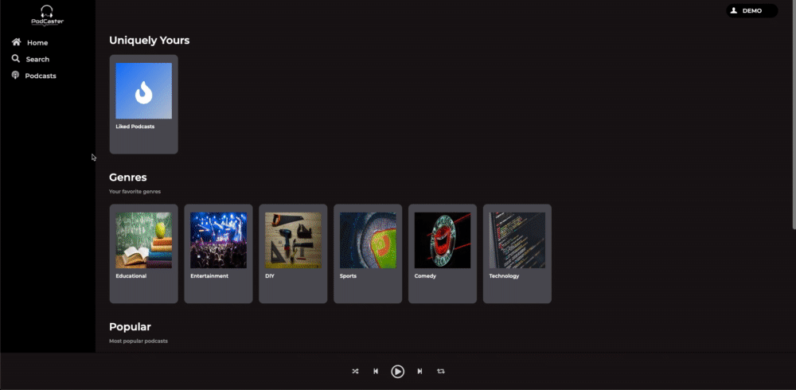

# PodCaster

PodCaster is an online podcast streaming service modeled after Spotify that allows you to find Podcasts of any topic your heart desires!

[Live Site](https://pod-caster.herokuapp.com/)



## Technologies Used:

* JavaScript

* Reactjs

* Redux

* HTML5

* SCSS / CSS

* Ruby on Rails

* PostgreSQL

* AWS S3

* FontAwesome

* Heroku

# Frontend and Backend User Auth

Users are not able to create or login to an account unless all frontend validations have been met. My user model takes care of checking if an email has already been taken and if a password has met minimum length. Passwords are thoroughly protected and never stored as plain text in the database, instead passwords are salted and hashed using BCrypt.

```
class User < ApplicationRecord
    validates :email, presence: true, uniqueness: true
    validates :session_token, presence: true, uniqueness: true
    validates :username, presence: true, uniqueness: true
    validates :gender, inclusion: { in: [ "Male", "Female", "Non-Binary" ] }
    validates :dob, presence: true
    validates :password_digest, presence: true
    validates :password, length: { minimum: 6 }, allow_nil: true
    after_initialize :ensure_session_token

    # etc...
end
```

# Continuous Audio Playback

Users have the ability to listen to Podcasts while navigating the rest of the site. This was accomplished by making the media player it's own component which controlls all audio, so if another component is re-rendering it will not cause the media player to rerender. The audio itself is constucted with HTML5's Audio tags and a custom designed media player. The audio source is obtained from the audio slice of state which is changed upon clicking an episode.

```
class MediaPlayer extends React.Component {
    constructor(props) {
        super(props);
        this.state = {
            playing: false,
        }

        this.play = this.play.bind(this);
        this.pause = this.pause.bind(this);
    }

     render() {
   
        return (
            <>
                <footer className="footer-container">

                    <audio ref="music_player">
                        <source src={this.props.audio} />
                    </audio>

                    <button className="shuffle"><i className="fas fa-random"></i></button>
                    <button className="backward"><i className="fas fa-step-backward"></i></button>
                    {this.state.playing ? 
                        <button key="pause-icon" className="pause" onClick={this.pause}>
                        <i className="far fa-pause-circle"></i>
                        </button> 
                        : 
                        <button key="play-icon" className="play" onClick={this.play}>
                            <i className="far fa-play-circle"></i>
                        </button>
                    }
                    <button className="forward"><i className="fas fa-step-forward"></i></button>
                    <button className="replay"><i className="fas fa-retweet"></i></button>
                </footer>
            </>
        );
    }
```

# Features to Come:

### Podcast Creation

### Subscriptions

### Search